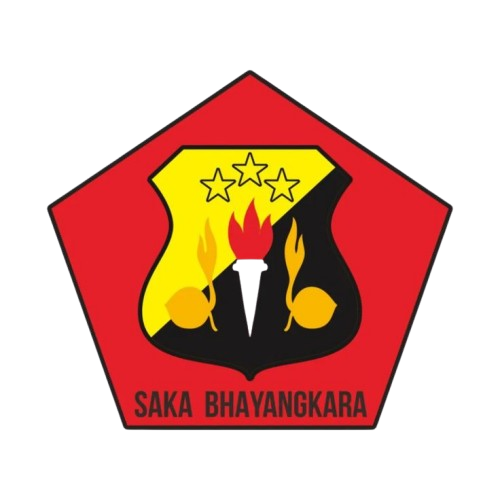
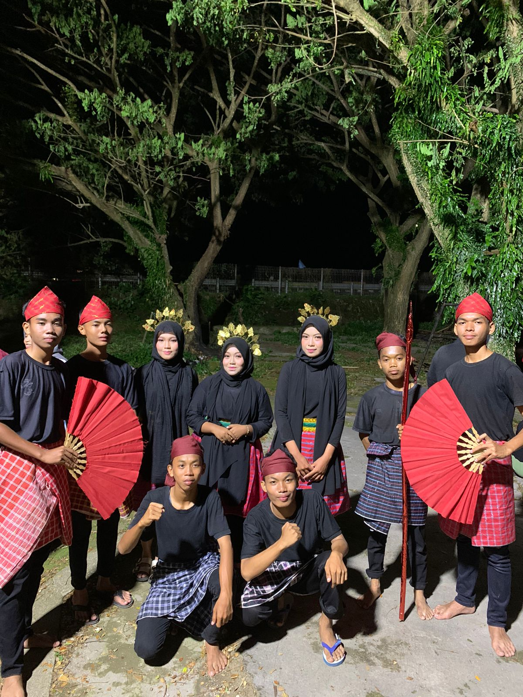
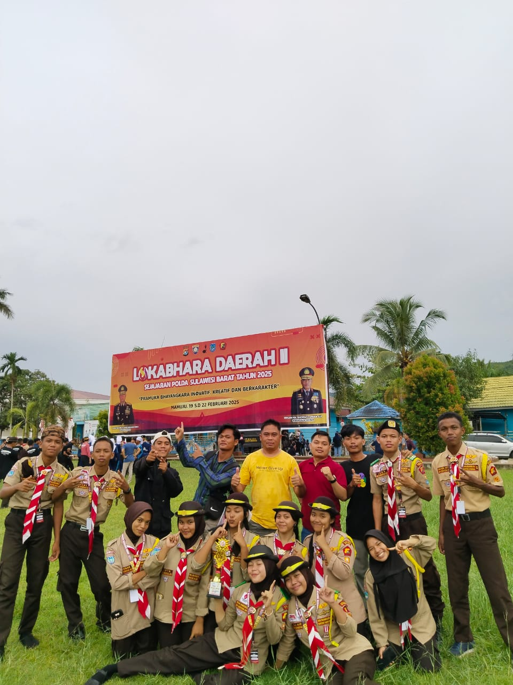
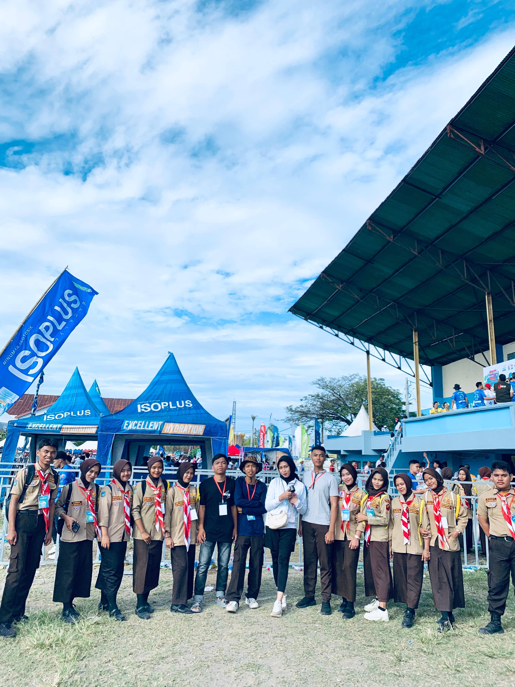
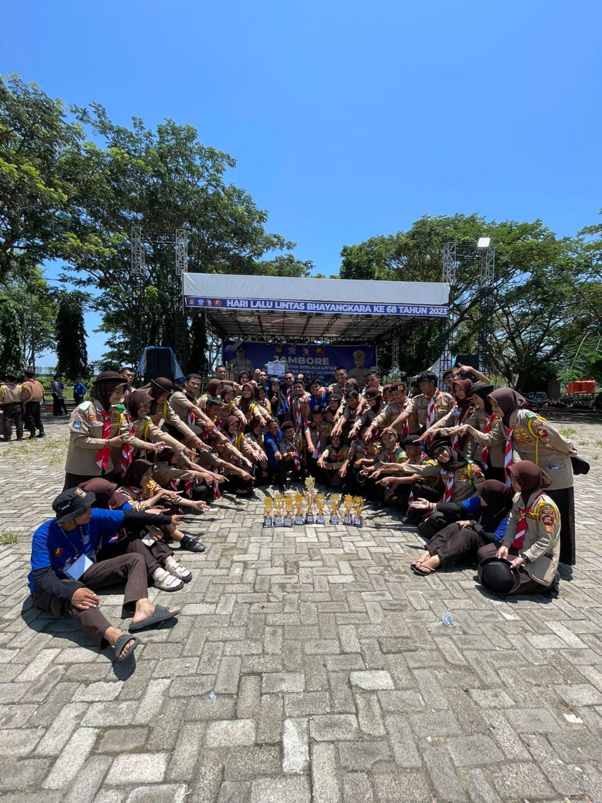

<!DOCTYPE html>
<html lang="id">
<head>
  <meta charset="UTF-8">
  <meta name="viewport" content="width=device-width, initial-scale=1.0">
  <title>SAKA BHAYANGKARA RANTING POLSEK BANGGAE</title>
  
</head>

<body>
  <header>
    
    <h1>SAKA  BHAYANGKARA RANTING POLSEK BANGGAE</h1>
  </header>

  <nav>
    <a href="#Saka">Satuan Karya</a>
    <a href="#Saka bhayangkara">Saka Bhayangkara</a>
    <a href="#satuan">Badge dan Krida</a>
    <a href="#dokumentasi">Dokumentasi</a>
    <a href="#keterangan">Keterangan</a>
  </nav>

  <section id="Saka">
       <h2>Satuan Karya (Saka) </h2>
      
  
     
Satuan Karya (Saka) Dalam Gerakan Pramuka Adalah Wadah Kegiatan Khusus Bagi Pramuka Penegak (Usia 16–20 Tahun) Dan Pandega (Usia 21–25 Tahun) Untuk Mengembangkan Minat, Bakat, Pengetahuan, Dan Keterampilan Tertentu Sesuai Bidangnya.

1.  Pengertian
<ul style="margin-left: 40px;"><li>Satuan Karya Sering Disingkat Saka.
<li>Saka Dibentuk Melalui Kerja Sama Gerakan Pramuka Dengan Instansi Pemerintah Atau Lembaga Tertentu Yang Memiliki Bidang Keahlian.</li>
<li>Anggota Saka Disebut Anggota Saka, Sedangkan Unit Terkecil Dalam Saka Disebut Krida (Kelompok Kecil Yang Membina Keterampilan Tertentu).</li>
</ul>
 2.  Tujuan Saka
<ul style="margin-left: 40px;"><li>Memberikan Kesempatan Kepada Pramuka Penegak Dan Pandega Untuk Memperluas Pengetahuan Serta Keterampilan Sesuai Minatnya.</li>
<li>Membina Semangat Pengabdian Kepada Masyarakat Dan Bangsa.</li>
<li>Membekali Generasi Muda Dengan Kecakapan Hidup (Life Skills) Di Bidang Tertentu.</li>
</ul>

  </section>

  <section id="Saka bhayangkara">
    <h2>Saka Bhayangkara</h2>
   
Saka Bhayangkara adalah salah satu satuan karya (saka) dalam Gerakan Pramuka Indonesia yang memiliki fokus pada bidang keamanan, ketertiban, dan kepolisian. Saka ini dibentuk untuk memberikan pendidikan, pelatihan, dan pengalaman praktis kepada anggota pramuka muda dalam memahami tugas-tugas kepolisian dan menjaga keamanan masyarakat. Berikut penjelasan lebih lengkap:.

  <ol start = "1">
  <h3><li> Tujuan Saka Bhayangkara</li></h3></ol>
   <ul style="margin-left: 40px;">
    <li>Membekali anggota Pramuka dengan <b>pengetahuan dan keterampilan kepolisian</b>, seperti disiplin, pengendalian lalu lintas, pertolongan pertama, dan penanganan keadaan darurat.</li>
  <li>Mengembangkan <b>sikap tanggung jawab, disiplin, dan kepedulian terhadap masyarakat</b>.</li>
  <li>Menyiapkan generasi muda untuk <b>ikut serta dalam menjaga keamanan dan ketertiban masyarakat</b>.</li></ul>
  
     <ol start="2"><h3><li>Materi Kegiatan</li>
</h3></ol>
     <ul style="margin-left: 40px;"> 
Kegiatan di Saka Bhayangkara biasanya meliputi:</ul>
   <ul style="margin-left: 40px;"> 
      <li><b>Pendidikan dan pelatihan kepolisian:</b> teknik baris-berbaris, disiplin, komunikasi efektif.</li>
      <li><b>Simulasi keamanan:</b> patroli, pengaturan lalu lintas, pengenalan tugas polisi.</li>
      <li><b>Pertolongan pertama:</b> memberikan pertolongan pada kecelakaan atau situasi darurat.</li>
      <li><b>Kegiatan sosial:</b> ikut dalam kegiatan masyarakat seperti bakti sosial atau kampanye keselamatan.</li></ul>

   <ol start="3">
  <h3><li>Anggota Saka Bhayangkara</li></h3></ol>
   <ul style="margin-left: 40px;">
    <li>Terbuka bagi anggota Pramuka Penegak dan Pandega yang <b>memiliki minat dalam bidang keamanan dan kepolisian</b>.</li>
    <li>Anggota mendapat <b>pelatihan khusus dari Polri</b> dan bisa mengikuti lomba atau kegiatan kepemudaan di tingkat lokal maupun nasional.</li></ul>

   <ol start="4<ul style="margin-left: 40px;>   <h3><li>Manfaat Mengikuti Saka Bhayangkara</li></h3></ol>
   <ul style="margin-left: 40px;">
    <li>Meningkatkan <b>kedisiplinan, tanggung jawab, dan jiwa kepemimpinan</b>.</li>
    <li>Mendapatkan <b>pengetahuan praktis tentang keamanan dan kepolisian</b>.</li>
    <li>Kesempatan untuk <b>mengabdikan diri pada masyarakat</b> melalui kegiatan nyata.</li></ul>

<h2>Sejarah Singkat</h2>
   
Satuan Karya Pramuka (Saka) Bhayangkara dibentuk pada tahun 1996, dan pada tahun tersebut masih bernama Pramuka KAMTIBMAS (Keamanan Ketertiban Masyarakat). Pembentukan tersebut atas instruksi bersama MENTRI / PANGLIMA POLISI DAN KAKWARNAS : NO. POL. : 28/Inst. /MK/1966 dan SK KWARNAS No. 4 /1696 tertanggal : 1 Juli 1966, dengan nama PRAMUKA KAMTIBMAS. 

 <ul style="margin-left: 40px;"> 
  Pada waktu itu terdapat sembilan krida, yaitu :</ul>

<ul style="margin-left: 10px;"> 
<ol style="list-style-type: decimal;">
<li>Krida LANTAS (Lalu Lintas)</li>
<li>Krida PMK (Pemadam Kebakaran)</li>
<li>Krida SAR (Searce And Rescue)</li>
<li>Krida TPTKP (Tindakan Pertama Tempat Kejadian Perkara)</li>
<li>Krida SISKAMLING (Sistem Keamanan Lingkungan)</li>
<li>Krida PENGAWAL</li>
<li>Krida PELACAK</li>
<li>Krida KOMLEK</li>
<li>Krida PENGAMAT</li> </ol></ul>
<!-- 
 -->
  

Pada tahun 1980 dikeluarkan surat keputusan atas kerja sama Kepolisian Negara Republik Indonesia (POLRI) dengan KAKWARNAS yaitu : NO. POL. SKEP / 08 / V / 1980 dan SK KWARNAS No. 050 / 1980 tanggal 1 Juli 1980, bernama SATUAN KARYA BHAYANGKARA. Ditahun 1980 pembentukan krida masih mengikuti Sembilan krida sebelumnya. Baru pada tahun 1990 dikeluarkan surat keputusan dari KAKWARNAS melewati  SK KWARNAS No. 032 / 1990 terdapat tujuh krida yang terbentuk, yaitu :

<ul style="margin-left: 10px;"> 
<ol style="list-style-type: decimal;">
<li>Krida LANTAS (Lalu Lintas)</li>
<li>Krida PMK (Pemadam Kebakaran)</li>
<li>Krida SAR (Searce And Rescue)</li>
<li>Krida TPTKP (Tindakan Pertama Tempat Kejadian Perkara)</li>
<li>Krida SISKAMLING (Sistem Keamanan Lingkungan)</li>
<li>Krida PENGAWAL</li>
<li>Krida PELACAK</li>
</ol></ul>

Pada tahun 1991 jumlah krida yang ada dipersingkat lagi yang sebelumnya 7 menjadi lima krida, yaitu :

<ul style="margin-left: 10px;"> 
<ol style="list-style-type: decimal;">
<li>Krida LANTAS (Lalu Lintas)</li>
<li>Krida PMK (Pemadam Kebakaran)</li>
<li>Krida SAR (Searce And Rescue)</li>
<li>Krida TPTKP (Tindakan Pertama Tempat Kejadian Perkara)</li>
<li>Krida SISKAMLING (Sistem Keamanan Lingkungan)</li>
</ol></ul>

Setelah itu pada tahun 2006 berdasarkan Surat Keputusan Kepala Kepolisian Negara Republik Indonesia NO. POL. SKEP / 595 / X / 2006 tertanggal 4 Oktober 2006 jumlah krida dipersingkat lagi menjadi 4 krida, yaitu :

<ul style="margin-left: 10px;"> 
<ol style="list-style-type: decimal;">
<li>Krida LANTAS (Lalu Lintas)</li>
<li>Krida P2B (Pencegahan dan Penanggulangan Bencana)</li>
<li>Krida TPTKP (Tindakan Pertama Tempat Kejadian Perkara)</li>
<li>Krida TIBMAS (Ketertiban Masyarakat)</li>
</ol></ul>

<b>Tujuan:</b>

<ul style="margin-left: 10px;"> 
<ol style="list-style-type: decimal;">
<li>Membina Dan Mengembangkan Generasi Muda Agar Berjiwa Patriotik, Disiplin, Dan Taat Hukum.</li>
<li>Memberikan Pengetahuan, Keterampilan, Dan Pengalaman Di Bidang Keamanan Dan Ketertiban Masyarakat (Kamtibmas).</li>
<li>Membantu Tugas-Tugas Kepolisian Secara Terbatas, Sesuai Kemampuan Pramuka Dan Arahan Pembina.</li>
</ol></ul>

  </section>

  <section id="satuan">
    <h2>Badge dan Krida Saka Bhayangkara</h2>
   
Badge (dibaca béj) adalah sebuah tanda, lencana, atau simbol yang diberikan untuk menunjukkan identitas, status keanggotaan, wewenang, atau pencapaian tertentu, yang bisa berupa bentuk fisik yang dikenakan di pakaian atau bentuk virtual yang ditampilkan secara digital. 

  <ol start = "1">
  <h3><li>Badge Saka Bhayangkara</li></h3></ol>
 
Berikut adalah penjelasan lebih rinci mengenai setiap elemen lambang:

   <ul style="margin-left: 40px;">
    <li><b>Bentuk Segi Lima:</b> Melambangkan falsafah Pancasila sebagai dasar negara. </li>
    <li><b>Bintang Tiga dan Perisai:</b> Merupakan simbol Tri Brata dan Catur Prasetya, yang merupakan kode etik bagi Kepolisian Negara Republik Indonesia. .</li>
    <li><b>Obor:</b> Melambangkan "Sumber Terang Sejati".</li>
    <li><b>Api Tiga Cahaya (Triwikrama):</b> Terdiri dari tiga bagian cahaya yang menjulang, melambangkan tiga pancaran cahaya: kesadaran, kewaspadaan, dan kebijaksanaan. </li>
    <li><b>Tunas Kelapa:</b> Melambangkan Gerakan Pramuka itu sendiri, dengan segala arti kiasannya, termasuk kemampuan bertahan dalam kondisi apa pun. </li>
  </ul>
  

  

 <section id="dokumentasi">
  <h2>Dokumentasi Kegiatan</h2>
  

    

      
      
Lokabhara 1 - Lomba Seni Tari

    

    

      
      
Lokabhara 2 - Sesi Foto setelah Penutupan

    

    

      
      
Majene Run - Partisipasi anggota Saka Bhayangkara Banggae dalam Event Majene Run di Kabupaten Majene

    

    

      
      
Jambore Lantas - Foto Bersama

    

    

    

  

</section>

  <section id="keterangan">
    <h2>Keterangan Tambahan</h2>
    <ul>
      <b>-</li>

  </section>

  <footer>
    
&copy; 2025 Saka Bhayangkara Ranting Polsek Banggae | @Iqra

  </footer>
</body>
</html>
